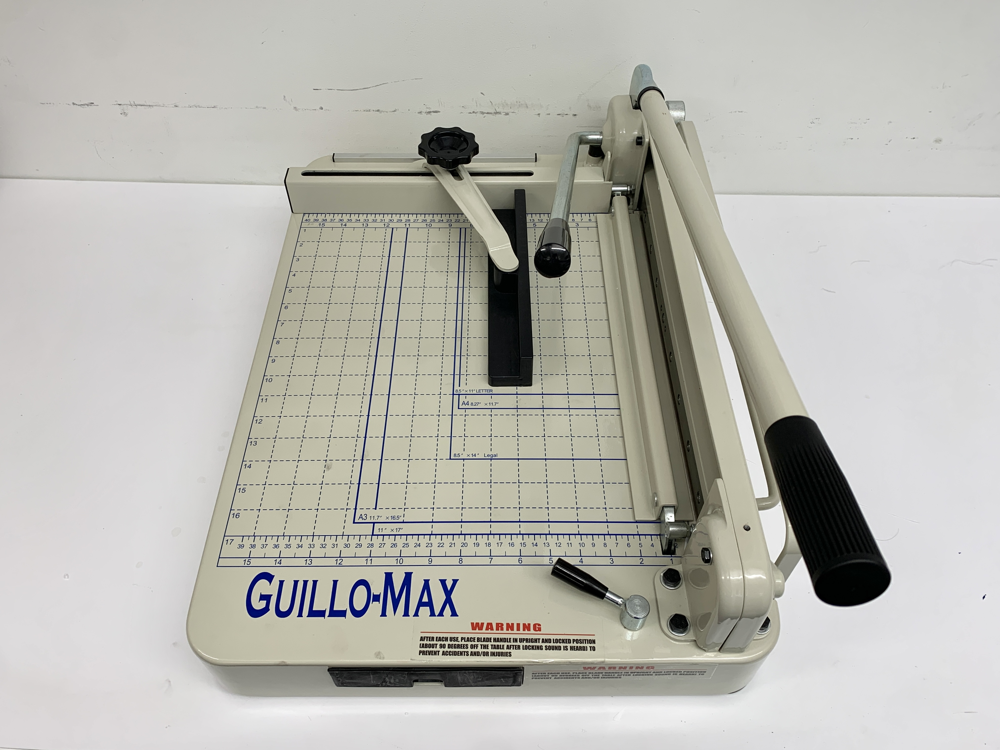

# Paper Cutter

 

 
 

**About Guillo-Max**

Guillo-Max is a heavy duty manual Stack Paper Cutter. Max capacity:

* 360 pieces of paper or 1-½” thick copy paper cutting capacity
* Inches/cm grid
* Net wt. 76 Ibs
* Ideal for cutting multiple sheets of paper

  

**Before Cutting**
* Lift both locking lever and cutting levers to the 90 degree upright position 

* Make sure the lock on the right bottom is properly locked

* The cutter must be placed on the secure platform for proper use.

* Inspect the cutter just with your eyes to see no other material or residue is stuck on the blade. (DO NOT touch the blade with your hands)

* Prepare your materials in the format you want to be cut.

  
**While Cutting**

1. Put the material you want to cut from the left side of the cutter.

2. Push the material beneath the blades to the position you want to them to be cut

3. untighten/tighten the screw and move the alignment arm to the position to hold the materials in its position.

4. Pull down the lever so the paper holder could clamp down your materials

5. Pull open the lock in the anti-clock direction

6. With the lock open with one hand, gently pull down the lever with another and apply downward force on the lever to cut the material (DO NOT Apply sudden force)

7. If there were any problem with the cutting procedures or the result cut is not satisfactory , repeat the process from 1 - 4

  
**After Cutting**
* After each use, place blade handle and clamp handle in upright and locked position

* Clean up the residue material

* Untighten the aligning arm screw 

  
**PRECAUTIONS**

* Do not use your hands to touch the blades 

* Do not go over the maximum capacity

* Do not attempt to cut other materials other than paper

  

If you have any difficulty or questions regarding the use of machine, please consult with the residing staff or reach out to the email below:

jy3424@nyu.edu

For additional guidance, please watch the video below
