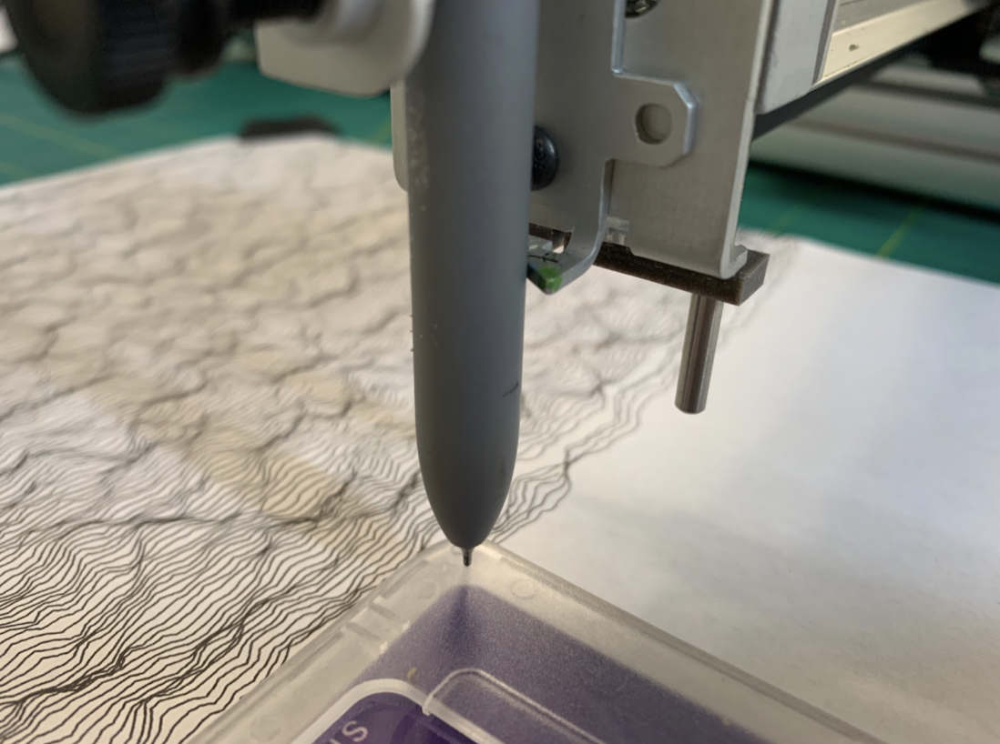

# Plotter

[Overview](#Overview)

[Software Setup](#Software-Setup)

[SVG preparation](#SVG-preparation)

[Pen and Paper Size](#Pen-and-Paper-Size)

[Basic Plotting Process](#Basic-Plotting-Process)

[Plotting Tips](#Plotting-Tips)

[Vpype](#Vpype)

[Safe Handling](#Safe-Handling)

[Troubleshooting](#Troubleshooting)

<br><br>

### Overview

(picture) 
 
IDM has two AxiDraw V3 machines

The AxiDraw V3 is a simple, modern, precise, and versatile pen plotter, capable of writing or drawing on almost any flat surface. 


---

### Software Setup

* Download [Inkscape](https://inkscape.org/release/inkscape-1.3.2/)


* Install Inkscape [Extension](https://wiki.evilmadscientist.com/Axidraw_Software_Installation): After installing Inkscape, install the Axidraw extension. It will appear under the "Extensions" menu in Inkscape. You should see the AxiDraw Control option in the drop-down menu
<br><br>
<div align="center">
 
 </div>

* Select Axidraw Model
  
  in the AxiDraw Control Panel, select options - config - Axidraw Model as AxiDraw V2,V3, or SE/A4

---

### SVG preparation

You can control Axidraw through the Axidraw plugin in Inkscape. Inkscape can open and work with SVG files.

SVG, or Scalable Vector Graphics, is an XML-based format for creating two-dimensional vector graphics. You can create it in various ways, such as using coding frameworks like p5.js or design software like Adobe Illustrator.

**For p5js:**

Add this script to your index html page

```<script src="https://unpkg.com/p5.js-svg@1.5.1"></script>```


In addition, change your P5 cloud version to 1.6.0 instead of the default 1.10.0 or other versions as shown above. Otherwise you may encounter errors in exporting SVG with this script

Here’s an [example](https://zenozeng.github.io/p5.js-svg/examples/#exporting ) of the code you need to add to your js file in order to export.

---

### Pen and Paper Size

The machine supports a variety of pen types, including fountain pens, permanent markers.
Check out this github page from [awesome-plotters](https://github.com/beardicus/awesome-plotters?tab=readme-ov-file#pens) for more suggestions on pens.

Maximum Drawing Area：The XY travel (printable area) of the AxiDraw is just over US letter (8 1/2 × 11") and A4 (297 × 210 mm / 8.27 × 11.69 inches) paper sizes. To avoid grinding the motors in the machine, ensure you leave a ½ inch of bleed around the edge of your plot. This means your plot should be 7 1/2 x 10 inches in size.

---

### Basic Plotting Process

Steps:

1. Before connecting to power, manually move the Axidraw back to its origin if it's not already there. 

2. Then connect Power and USB: Plug in the power adapter and connect the Axidraw to your computer via the USB cable.

3. Clip in your pen, with height a little above the paper, roughly equal to the thickness of your NYU iD card (with case).
<br><br>
<div align="center">

</div>
<br><br>
4. Position your paper with its upper-right corner below the pen tip. Leave a few millimeters for bleeding to avoid the pen pushing the paper's edge up while drawing. AxiDraw is very sensitive to height. Make sure the paper is completely flat. Use tape to secure the corners of the paper.
<br><br>
<div align="center">
  
  
</div>
<br><br>
<div align="center">

</div>
<br><br>

5. Open your svg file. From the menu, select Extensions > AxiDraw > AxiDraw Control

6. In the Setup tab, use the Cycle pen down then up option. No need to change the default parameters. Click Apply.

<br><br>
<div align="center">

</div>
<br><br>

7. Test and adjust the pen height, until the pen tip touches the paper.

8. Using the Plot tab in AxiDraw Control, click Apply to plot the document.


---

### Plotting Tips

* Plotting against a stack of paper instead of a single sheet on a hard surface enhances the quality of the lines.

* Make sure you unplug the AxiDraw when it’s not in use. This will help extend the life of the servo significantly.

---

### Vpype

* Using [vpype](https://github.com/abey79/vpype) to optimize your SVGs. See [install](https://github.com/golanlevin/DrawingWithMachines/blob/main/generating_svg/vpype_svg_prep/README.md) instructions prepared by Golan.

* Using vpype to [crop and optimize](https://docs.google.com/document/d/1pjKwBRsNlkh2uOvMGCCnimFWsA3aGu-aKxT9qTDvRws/edit?tab=t.0#heading=h.mqiwt0pshqbh) SVGs. (This will save you a lot of time drawing)

---

### Safe Handling

1) Lifting: Lift AxiDraw by the central strut of the base, or by the stepper motors
if necessary. Do not lift by the cables, cable guides, carriages, or pen holder. The
AxiDraw SE/A3 has a handle milled into the back of the central strut, to provide
an additional lifting point in the middle of the machine.

2) Heat: Please note that the two stepper motors may get warm. This is normal,
but it is helpful to be aware of it. They should not get too hot to touch.

3) Moving parts: AxiDraw has exposed moving parts. Keep fingers, hair, and oth-
er things that could get caught, crushed, or tangled safely away from the belt and
the pinch points between the moving carriage, the pen holder, and the motor
covers.

---

### Troubleshooting

* When loading a new file, before starting to draw, change the document size (in document properties ) to inches.

<div align="center">
 
</div>

<br><br>

* Unwanted hidden lines

Axidraw may pick up hidden lines in the file (e.g. a bounding box), and you can remove these lines in the option menu by checking the Hidden-line removal box.

<div align="center">
 
 </div>

<br><br>

* Plot optimization (Default: Least; Only connect adjoining paths):
This option affects the order of plotting, which can be altered to reduce pen-up
travel time.

By default, Plot optimization is disabled, and objects in the document will be plotted in the order given by the file. However if either “Basic” or “Full” is selected, then elements within the file will be reordered to reduce pen-up travel when you run a plot or plot preview from the Plot, Layers, or Resume tab. 


* Power is loose/ not plugged in. Reconnect the power.
<br><br>
<div align="center">
 
</div>
 
* Reconnect the USB cable
<br><br>
<div align="center">
 
</div>
 
 
 
---

