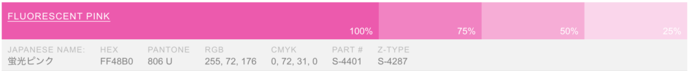

# A Guide to Riso Printing

### What is Risograph

The Risograph is a stencil duplicator. Think of it as a cross between screen printing and photocopying. The RISO prints one color at a time in bright, vibrant colors. It is ideal for posters, graphic prints, zines, comics, and other graphic arts. 
The RISO in the lab is a single drum, only printing one color at a time. To get a sense of how the RISO works watch this [video](https://youtu.be/ofIh4EtGVno?si=sjgOvS4qsWB36E5z). 

### Equipment

Meet Frida, the IDM Print Lab’s Risograph!

* Machine

It is a Riso SF 9450 printer. The manual for this machine is available [here](https://www.manualslib.com/products/Riso-Sf-9450-8854119.html). 

* Ink Color

Currently we have seven different colors.

 i. Black 
 
 

 
 

 
 ii. Blue 

 
 iii. Green 

 
 iv. Yellow 

 
 v. Fluorescent Pink 
 
 
 vi. Fluorescent Orange 

 vii. Red
  
  
  
color charts

---

### File preparation

Riso interprets grayscale images as density of inking. The printer will print each color separately. Each color should be prepared as a greyscale image (these are called contact sheets). Contact sheets can be prepared in a number of ways. Either in photoshop by [separating color channels into layers](https://docs.google.com/document/d/1HTgunAjIIVQx3ucljiIJW8KMf6T3q5kIDk6lDP8n59s/edit?tab=t.0#heading=h.j9fztmzedoqi), or using the p5.js Riso library that lets you set up color layers, draw to them, preview and export. For another resource on how to separate color channels, here is a [video](https://kellianderson.dropmark.com/897509/25784894) by Kelli Anderson.

**Dithering with the riso printer driver:**

Once you have your contact sheets you can either print them from the Preview program on the lab computer as you would for any other printer, or you can print them from Photoshop using the Riso driver. Using Photoshop and the driver gives you more control over the way that the image is dithered. See this [guide](https://ameliagreenhall.com/printing-with-the-riso-printer-driver-for-mac/) on photoshop print and color settings.

---

### Paper Size and Bleeding

The maximum paper size the printer can print is tabloid (11″ x 17″). The printer cannot print full bleed (this means it cannot print to the edge of the page). You should leave a 0.25″ margin around your image when printing, if you don’t, the printer will cut off the image.

This means the maximum printable area is approximately 10.5″ x 16.5″ on a tabloid size sheet. Trying to print outside of printable areas will lead to paper jams and unsuccessful prints.

As a rule of thumb, include a margin of 0.5 inch to the image size for cutting. For letter, change image size to 8 x 10.5 in.  For tabloid, change image size to 10.5 x 16.5 in. 

The Riso can print on the custom paper sizes below. 

---

### Paper Purchasing

Generally, any stationary or arts supply store will carry paper types in bulk. Here are some nearby stores for paper options: [Artist & Craftsman Supply](https://artistcraftsman.com/search.php?search_query=paper), [Blick](https://www.dickblick.com/stores/new-york/brooklyn-flatbush/), [Michaels](https://locations.michaels.com/ny/brooklyn/1276/), and [Paper Source](https://www.papersource.com).  

Unsealed/uncoated papers must be used as the paper needs to be able to absorb the ink.
Some examples of good paper types are: vellum, offset, and Hi-Bulk. Newsprints, kraft, and construction papers
Riso Inks may smudge after the prints have dried (technically, the ink never really sets).  
For more detailed information on paper types for Riso click [here](https://www.stencil.wiki/paper-choosing-ideal-stocks-riso).

