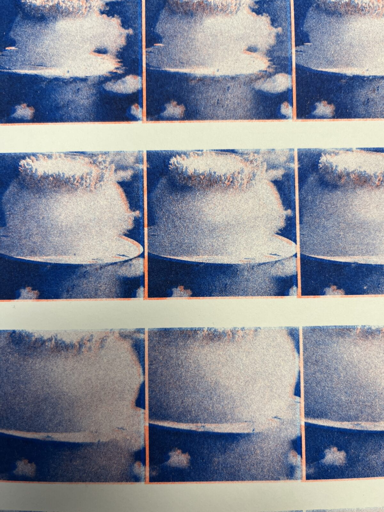

# A Guide to Riso Printing

### What is Risograph

The Risograph is a stencil duplicator. Think of it as a cross between screen printing and photocopying. The RISO prints one color at a time in bright, vibrant colors. It is ideal for posters, graphic prints, zines, comics, and other graphic arts. 
The RISO in the lab is a single drum, only printing one color at a time. To get a sense of how the RISO works watch this [video](https://youtu.be/ofIh4EtGVno?si=sjgOvS4qsWB36E5z). 
   
### Equipment

Meet Frida, the IDM Print Lab’s Risograph!
  
 

 
 

**Machine**

It is a Riso SF 9450 printer. The manual for this machine is available [here](https://www.manualslib.com/products/Riso-Sf-9450-8854119.html). 

**Ink Color**

Currently we have seven different colors.

 i. Black 
 
 

 
 

 
 ii. Blue 

 

 
 

 
 iii. Green 
 
  

 
 

 
 iv. Yellow 

 

 
 

 
 v. Fluorescent Pink 

 

 
 

 
 vi. Fluorescent Orange 
 
 

 
 

 vii. Red

 

 
 

  
     
  
color charts

 

 
 

---

### File preparation

Riso interprets grayscale images as density of inking. The printer will print each color separately. Each color should be prepared as a greyscale image (these are called contact sheets). Contact sheets can be prepared in a number of ways. Either in photoshop by [separating color channels into layers](https://docs.google.com/document/d/1HTgunAjIIVQx3ucljiIJW8KMf6T3q5kIDk6lDP8n59s/edit?tab=t.0#heading=h.j9fztmzedoqi), or using the p5.js Riso library that lets you set up color layers, draw to them, preview and export. For another resource on how to separate color channels, here is a [video](https://kellianderson.dropmark.com/897509/25784894) by Kelli Anderson.

**Dithering with the riso printer driver:**

Once you have your contact sheets you can either print them from the Preview program on the lab computer as you would for any other printer, or you can print them from Photoshop using the Riso driver. Using Photoshop and the driver gives you more control over the way that the image is dithered. See this [guide](https://ameliagreenhall.com/printing-with-the-riso-printer-driver-for-mac/) on photoshop print and color settings.

---

### Paper Size and Bleeding

The maximum paper size the printer can print is tabloid (11″ x 17″). The printer cannot print full bleed (this means it cannot print to the edge of the page). You should leave a 0.25″ margin around your image when printing, if you don’t, the printer will cut off the image.

This means the maximum printable area is approximately 10.5″ x 16.5″ on a tabloid size sheet. Trying to print outside of printable areas will lead to paper jams and unsuccessful prints.

As a rule of thumb, include a margin of 0.5 inch to the image size for cutting. For letter, change image size to 8 x 10.5 in.  For tabloid, change image size to 10.5 x 16.5 in. 

The Riso can print on the custom paper sizes below. 
    
 

 
 

 
  

 
 

---

### Paper Purchasing

Generally, any stationary or arts supply store will carry paper types in bulk. Here are some nearby stores for paper options: [Artist & Craftsman Supply](https://artistcraftsman.com/search.php?search_query=paper), [Blick](https://www.dickblick.com/stores/new-york/brooklyn-flatbush/), [Michaels](https://locations.michaels.com/ny/brooklyn/1276/), and [Paper Source](https://www.papersource.com).  

Unsealed/uncoated papers must be used as the paper needs to be able to absorb the ink.
Some examples of good paper types are: vellum, offset, and Hi-Bulk. Newsprints, kraft, and construction papers
Riso Inks may smudge after the prints have dried (technically, the ink never really sets).  
For more detailed information on paper types for Riso click [here](https://www.stencil.wiki/paper-choosing-ideal-stocks-riso).

---

### Loading ink

The [video](https://youtu.be/Ng0gicaYC3E?si=A3dhHFABZAecFoTL) documents the basic printing process and was prepared by Andrew Lau. It shows the basic printing process - Loading ink cylinders and paper.

* Turn machine on by moving the black switch on the right side of the machine.
If the machine is on but seems to be asleep, press the Wake-Up button to the right of the keyboard

* Open the door.
Make sure the blue light for the “Print Cylinder Release Button” is on. If not, press that button

 

  
 

 
 

  
 

 

 

 
* Pull the blue handle of the ink drum
* Hold ink drum by blue parts, place carefully place it on the floor or table
  

 

  
* Open the container for the new ink and, holding the new drum by the blue parts, place it on the ink holder. Place old ink drum inside the hard case and put it away. Close ink drum and close the front door.

---

### p5.Riso library

[p5 Riso](https://antiboredom.github.io/p5.riso/)

p5.riso.js is a p5 library for riso printing. It means you can use p5 to create graphics and prepare the color layers for printing. p5.riso object extends the p5 graphics object so that all the graphics functions can be used from the library. 

See [this](https://github.com/antiboredom/p5.riso/blob/master/tutorials/getting-started.md) getting started tutorial and the full example [code](https://editor.p5js.org/brain/sketches/GpuJH1Zur) here.

See [this](https://github.com/antiboredom/p5.riso/blob/master/tutorials/color-separation.md) tutorial on simple color separation and full example [code](https://editor.p5js.org/brain/sketches/wLGAPKEMk) here.

See the [reference](https://antiboredom.github.io/p5.riso/#ref) page and [example](https://antiboredom.github.io/p5.riso/#ex) page for more info on the functions and more examples.

---

### Troubleshooting

* Paper jam

The RISO can't print 100% ink density across 100% of the paper. Large areas of 100% ink density can cause jams (surface area over 40% of the paper at 100% in density will jam). 
To prevent jamming, it's best to design with your darkest color at 85% opacity.

* Paper feed adjustment dial

Paper jams often occur because of the paper weight. Lower the feed paper tray by pressing the button (marked with a 1. below). Adjust the dial according to your paper thickness (marked with a 2 below).

In addition, paper may be stuck to the master on the ink drum. Check the drum by pulling it out as if the color is being changed and peel the paper off the drum.

 

  

When papers are skipped, turn the dial(2) counterwise

When multiple paper are fed, turn the dial(2) clockwise

  
* Roller smudges

Print light colors first to reduce smudges. If you don’t let your prints dry, when you refeed the paper through ink will stick to the rollers. Let your prints dry for 10 minutes before each new color. 

To clean the rollers, lower the paper tray, use a wet wipe and clean the two rubber rollers by rotating the wheel and cleaning while you go. Dry with a paper towel and try again. This mark can also be reduced by printing 10 or more prints. You can also clean it with a pencil eraser.
  

 

  
* Registration errors

Registration errors are when two or more color layers don't perfectly line up. They can happen in both vertical and horizontal directions. See the images below. 

Vertical and horizontal registration errors between the blue and orange layers.
To move the blue layer to the left, adjust the plate to the right by turning the blue wheel backward as shown below. This is because the paper's path is relative to the ink screen as it passes under the screen.
  

 

  

 

To correct horizontal registration errors, adjust the position of the paper feed tray using the blue wheel as shown below.
  

 

To correct vertical registration errors, use the printer adjustment buttons shown below to shift the color layer being printed until it is better aligned with the preexisting layer.

 

