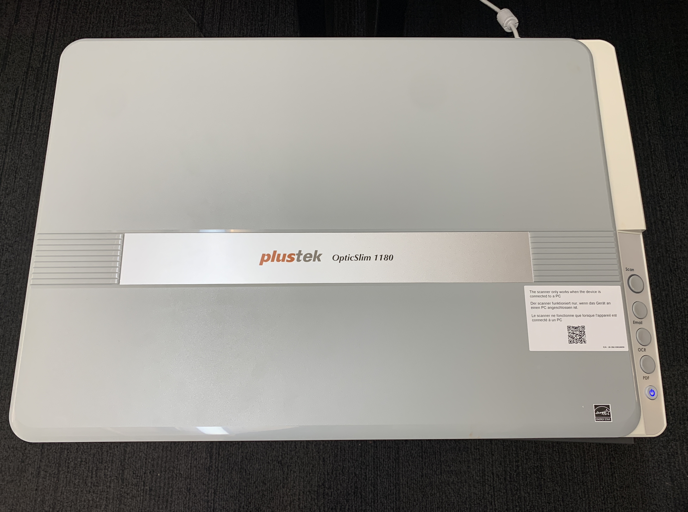

# Scanner
   

[Equipment](#Equipment)

[Configuration](#Configuration)

[Basic Operation Steps](#Basic-Operation-Steps)

[Software Configuration](#Software-Configuration)

[Troubleshooting](#Troubleshooting)

   

 

 
 

 
  

 
 

   
### **Equipment**

We have a Plustek OpticSlim 1180 

Scanner type: Flatbed Scanner

Speed: Scan an A3 document (11.7 x 17) in 8 sec @ 300 dpi Color/Greyscale/B&W mode
   

* Scan modes

Color: 48-bit input, 24-bit output

Grayscale: 16-bit input, 8-bit output

B/W: 1-bit output

Optical Resolution: 1200 dpi

Hardware Resolution: 1200dpi X 1200dpi
   

### **Hardware Configuration**
   

 

 
 

   
### **Basic Operation Steps**

1. Make sure power cable(black cable) is plugged in correctly

2. Make sure the gray cable is connected to the computer's main unit, not the monitor.

3. Turn on the machine by pressing the power button

4. Lift the cover and place the material for scanning in a proper orientation

5. Close the cover 

  

### **Software Configuration**
  

  
* Click ‘OpticSlim 1180’ app on the left side of the screen (orange color icon)

   
  

 
 

   

* You can change the resolution and other settings like scan mode, page size, and etc. on the screen above 

* Press ‘Scan’ on the machine. The scanning time depends on the resolution you choose. After scanning, the scanned image will pop up on the ‘plustek ePhoto’ app on the screen.
   

 

 
 

   

 

 
 

  

**After Scanning**

1. Open Finder, go to Documents, and select folder named “MacAction”

2. The file name will be the date in time of creation in default

3. For example, if you scanned it on September 30 2024, the file name would start with “2024-09-30-16” followed by the time it was scanned

   

### **Troubleshooting**

* Make sure both cables are properly connected in the correct orientation

* Make sure the Scanner is powered on.

* Make sure you press ‘Scan’ and hold down the button for more than a second.
